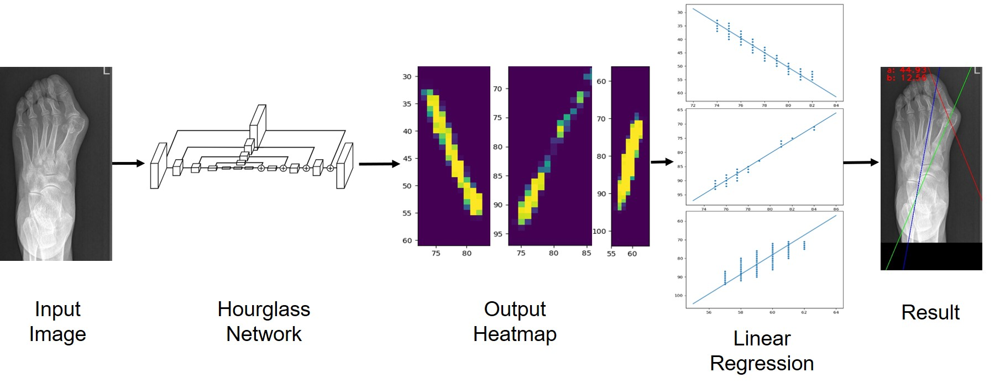
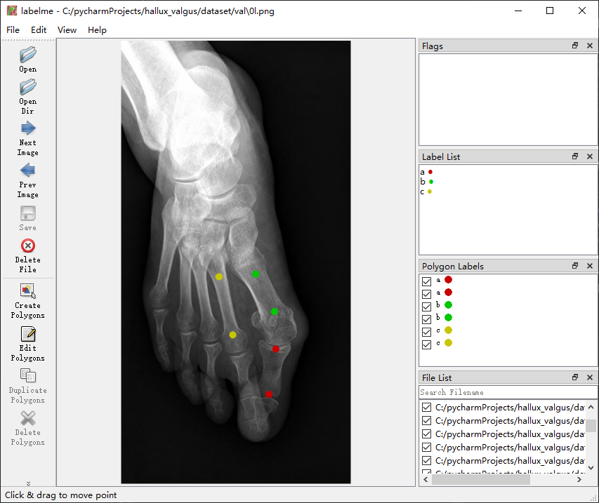

# Angle Estimation Based on Deep Learing
基于深度学习的角度测量方法

The implementation of paper [**A Dataset and Method for Hallux Valgus Angle Estimation Based on Deep Learing**](https://arxiv.org/abs/2107.03640). 

##Requirement
```
opencv-python
matplotlib>=3.3.4
numpy>=1.20.1
tensorflow>=2.3.0
keras>=2.4.3
```
##Dataset
Our dataset include 150 train samples and 65 validation samples.
You can down load the dataset from [**google drive**](https://drive.google.com/file/d/1rSqSY3E99IIL_t5ltXT3EZJIjXDO6L3r/view?usp=sharing) or [**baidu netdisk**](https://pan.baidu.com/s/1TPcPsm-GRxM-7MQm6lidGA) (链接：https://pan.baidu.com/s/1TPcPsm-GRxM-7MQm6lidGA 提取码：lciu). Please download and unzip the data, make them like below:
```
--projectDir
----dataset
------train
------val
```
We use **labelme** to label the images, the labels are json files which have the same filenames with images. You can preview the labels with **labelme**.

##How to Run
You can run test.py with pretrained weights in checkPoints. You can also train your own model with your custom data.
